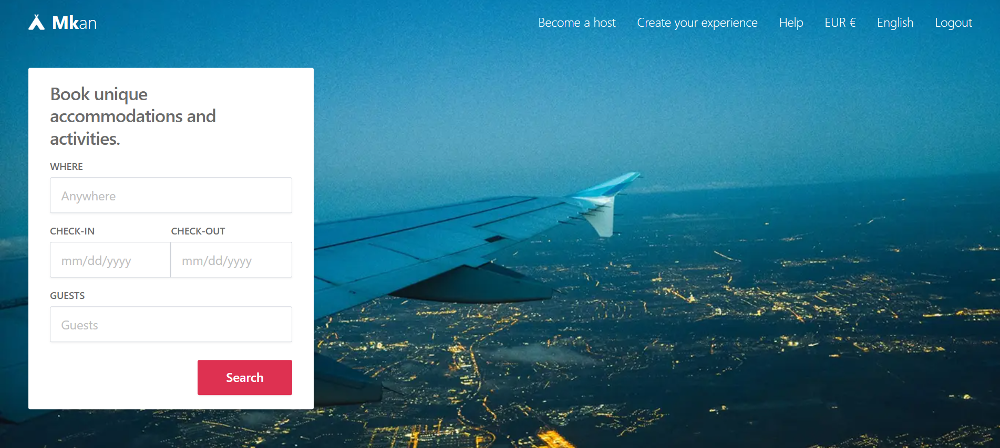
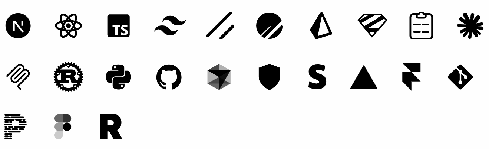

# Mkan

Mkan is a rental marketplace that connects tenants with property managers, offering a seamless experience for discovering, touring, and securing rental properties. Built with Airbnb-inspired design patterns.
 

Credit: [Airbnb](https://airbnb.com)

 

## Documentation

Visit https://databayt.org/docs to view the documentation.

## Contributing

Please read the [contributing guide](/CONTRIBUTING.md).

## License

Licensed under the [MIT license](https://github.com/shadcn/ui/blob/main/LICENSE.md).